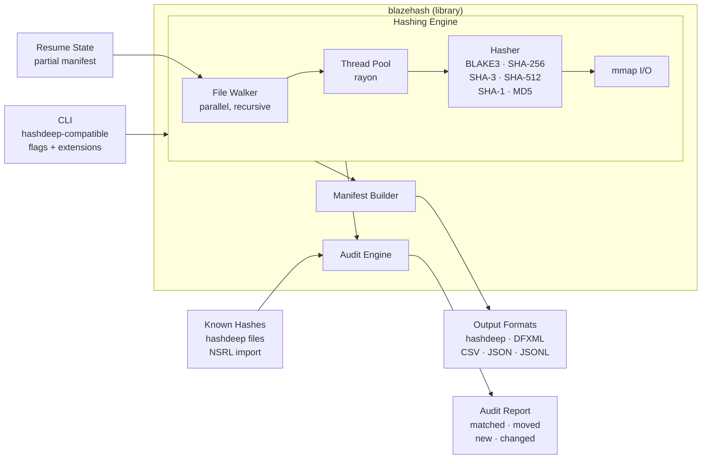

# blazehash

[](https://crates.io/crates/blazehash)
[](LICENSE)
[](https://github.com/SecurityRonin/blazehash/actions/workflows/ci.yml)
[](https://github.com/SecurityRonin/blazehash/releases)
[](https://github.com/sponsors/h4x0r)

hashdeep for the modern era. BLAKE3 by default. Multithreaded. Memory-mapped. Drop-in compatible with every hashdeep flag, plus new ones. [**Up to 3.4x faster**](docs/benchmarks.md) than hashdeep on the same algorithms — and [**~5x faster**](docs/benchmarks.md#the-blake3-advantage) when you switch to BLAKE3.

Point this at a case directory. Get a cryptographically verified manifest in seconds, not hours.

```bash
blazehash -r /mnt/evidence -c blake3,sha-256 -o results.hash
```

```
blazehash v0.1.0 — BLAKE3 + SHA-256, 16 threads, mmap I/O
[*] Scanning /mnt/evidence recursively
[+] 847,293 files hashed (2.14 TiB) in 38.7s
[+] Throughput: 56.6 GiB/s (BLAKE3) · 4.2 GiB/s (SHA-256)
[+] Manifest written to results.hash
```

## Why This Tool Exists

[hashdeep](https://github.com/jessek/hashdeep) is one of the most important tools in digital forensics. Written by [Jesse Kornblum](https://github.com/jessek) and [Simson Garfinkel](https://simson.net/), it gave the forensic community a reliable, auditable way to hash files and verify evidence integrity. Its audit mode, recursive hashing, and known-hash matching set the standard that every forensic lab depends on. hashdeep is a work of the US Government and has been freely available to the community since its inception.

We owe Jesse a debt of gratitude. hashdeep solved a real problem and solved it well.

But hashdeep was written in an era of spinning disks, single-core CPUs, and MD5 as a default. The world moved on. Evidence volumes grew from gigabytes to terabytes. NVMe drives can push 7 GB/s. CPUs ship with 16+ cores. NIST deprecated SHA-1. And BLAKE3 — designed from the ground up for parallelism and hardware acceleration — can hash at memory bandwidth speeds.

hashdeep hasn't had a release since v4.4. It doesn't support BLAKE3. It doesn't use multiple cores. It doesn't memory-map files. It can't resume interrupted runs. It can't export to DFXML or JSON.

**blazehash** intends to bring hashdeep into modern times. Every hashdeep flag works exactly as you expect. The output format is compatible. Your existing scripts, your audit workflows, your court-tested procedures — they all keep working. We just make them faster, add the algorithms the community needs, and fill the gaps hashdeep never got to.

This is not a replacement. It is a continuation.

## Performance

Benchmarked on Apple M4 Pro (14-core, 48 GB RAM). Both tools run on warm cache. Full methodology and results: **[docs/benchmarks.md](docs/benchmarks.md)**.

| Workload | blazehash | hashdeep v4.4 | Speedup |
|----------|----------:|----------:|--------:|
| 256 MiB file, SHA-256 | 854 ms | 930 ms | **1.09x** |
| 256 MiB file, SHA-1 | 275 ms | 572 ms | **2.08x** |
| 256 MiB file, 5 algos combined | 3.1 s | 3.5 s | **1.14x** |
| 1000 small files, SHA-256 | 20 ms | 69 ms | **3.43x** |
| Recursive walk (500 files) | 27 ms | 45 ms | **1.68x** |
| Piecewise (64 MiB, 1M chunks) | 163 ms | 339 ms | **2.08x** |
| **256 MiB file, BLAKE3** | **187 ms** | *not supported* | **~5x vs hashdeep SHA-256** |

**BLAKE3 at 1.37 GB/s** is blazehash's default — unavailable in hashdeep. For practitioners switching from `hashdeep -c sha256`: expect nearly **5x** end-to-end speedup (faster algorithm + faster implementation).

All hashes are bit-identical to hashdeep for shared algorithms (MD5, SHA-1, SHA-256, Tiger, Whirlpool). [Verified by automated cross-tool tests](docs/benchmarks.md#correctness).

## Install

### Homebrew (macOS)

```bash
brew tap SecurityRonin/tap
brew install blazehash
```

### Windows (winget)

```powershell
winget install SecurityRonin.blazehash
```

### Cargo (all platforms)

```bash
cargo install blazehash
```

### Pre-built binaries

Download from [GitHub Releases](https://github.com/SecurityRonin/blazehash/releases) — pre-built for:

| Platform | Architecture | Binary |
|----------|-------------|--------|
| macOS | Apple Silicon (M1/M2/M3/M4) | `blazehash-aarch64-apple-darwin` |
| macOS | Intel | `blazehash-x86_64-apple-darwin` |
| Linux | x86_64 (static, musl) | `blazehash-x86_64-unknown-linux-musl` |
| Linux | ARM64 (static, musl) | `blazehash-aarch64-unknown-linux-musl` |
| Windows | x86_64 | `blazehash-x86_64-pc-windows-msvc.exe` |

Linux binaries are fully static (musl) — no glibc dependency. Drop them on a SIFT workstation, a cloud instance, or an air-gapped forensic box and they just work.

### Build from source

```bash
git clone https://github.com/SecurityRonin/blazehash
cd blazehash
cargo build --release
```

### As a library

```toml
[dependencies]
blazehash = "0.1"
```

## Usage

blazehash is a **superset** of hashdeep. All hashdeep flags work, plus new ones.

### Hash a directory (BLAKE3, default)

```bash
blazehash -r /mnt/evidence
```

### Multiple algorithms

```bash
blazehash -r /mnt/evidence -c blake3,sha256,md5
```

### Audit mode (verify against known hashes)

```bash
blazehash -r /mnt/evidence -a -k known_hashes.txt
```

Audit reports match hashdeep output exactly: files matched, files not matched, files moved, files new.

### Export formats

```bash
blazehash -r /mnt/evidence --format hashdeep     # default, hashdeep-compatible
blazehash -r /mnt/evidence --format dfxml         # Digital Forensics XML
blazehash -r /mnt/evidence --format csv           # CSV with headers
blazehash -r /mnt/evidence --format json          # JSON array
blazehash -r /mnt/evidence --format jsonl         # one JSON object per line
```

### Import NSRL

```bash
blazehash -r /mnt/evidence --import-nsrl /path/to/NSRLFile.txt -a
```

Filters known-good files during audit using NIST's [National Software Reference Library](https://www.nist.gov/itl/ssd/software-quality-group/national-software-reference-library-nsrl).

### Resume interrupted runs

```bash
blazehash -r /mnt/evidence -o manifest.hash --resume
```

Picks up where it left off. Reads the partial manifest, skips already-hashed files, continues from the next file.

### Piecewise / chunk hashing

```bash
blazehash -r /mnt/evidence -p 1G     # hash in 1 GiB chunks
```

Piecewise hashing (hashdeep `-p` flag). Each file produces multiple hash entries, one per chunk. Useful for verifying partial transfers or detecting targeted modifications within large files.

### Size-only mode (fast pre-scan)

```bash
blazehash -r /mnt/evidence -s         # list files with sizes, no hashing
```

## Algorithms

| Algorithm | Flag | Default | Apple Silicon (M4) | x86_64 | Quantum Resilient | Notes |
|-----------|------|---------|-------------------|--------|-------------------|-------|
| BLAKE3 | `blake3` | Yes | NEON, internal tree parallelism | AVX-512, AVX2, SSE4.1 | Pre-quantum | 4x faster than SHA-256, designed for parallelism |
| SHA-256 | `sha256` | No | ARM SHA2 extensions (`sha256h/h2/su0/su1`) | SHA-NI | Pre-quantum | NIST standard, court-accepted everywhere |
| SHA-3-256 | `sha3-256` | No | NEON Keccak-f[1600] | AVX2 lane-parallel | Post-quantum candidate basis | Keccak sponge, different construction from SHA-2 |
| SHA-512 | `sha512` | No | Native 64-bit, NEON 2x interleave | AVX2 | Pre-quantum | Faster than SHA-256 on 64-bit CPUs |
| SHA-1 | `sha1` | No | ARM SHA1 extensions (`sha1c/p/m/h/su0/su1`) | SHA-NI | Broken | Legacy only, collision attacks published (SHAttered, 2017) |
| MD5 | `md5` | No | NEON vectorized | SSE2/AVX2 multi-buffer | Broken | Legacy only, collision attacks trivial since 2004 |
| Tiger | `tiger` | No | 64-bit optimized lookup tables | 64-bit optimized | Pre-quantum | hashdeep compatibility, 192-bit output |
| Whirlpool | `whirlpool` | No | Table-based, 64-bit native | Table-based, 64-bit native | Pre-quantum | hashdeep compatibility, 512-bit output |

BLAKE3 is the default because it is the fastest cryptographic hash on modern hardware while maintaining a 256-bit security level. For court submissions where opposing counsel may challenge algorithm choice, `sha256` remains the safe bet.

## How It's Fast

| Technique | What it does |
|-----------|-------------|
| BLAKE3 default | Hash function designed for parallelism — internally splits each file into 1 KiB chunks and hashes them across a Merkle tree |
| Memory-mapped I/O | Lets the OS page in file data directly, bypassing userspace read buffers. Eliminates a `memcpy` per read call |
| Multithreaded file walking | Directory traversal and hashing run on a thread pool (defaults to all cores). Large files are parallelized internally by BLAKE3; many small files are parallelized across threads |
| Streaming architecture | Files are hashed as they stream in. No file is ever fully loaded into memory, regardless of size |
| Hardware intrinsics | BLAKE3 uses AVX-512/AVX2/SSE4.1 on x86 and NEON on ARM. SHA-256 uses SHA-NI where available |

## Feature Comparison

How blazehash compares to hashdeep, b3sum, sha256sum, and other forensic hashing tools.

### Algorithms

| Feature | blazehash | hashdeep | b3sum | sha256sum | md5deep |
|---------|:---------:|:--------:|:-----:|:---------:|:-------:|
| BLAKE3 | Yes | No | Yes | No | No |
| SHA-256 | Yes | Yes | No | Yes | No |
| SHA-3-256 | Yes | No | No | No | No |
| SHA-512 | Yes | Yes | No | No | No |
| SHA-1 | Yes | Yes | No | No | No |
| MD5 | Yes | Yes | No | No | Yes |
| Tiger | Yes | Yes | No | No | No |
| Whirlpool | Yes | Yes | No | No | No |
| Multiple simultaneous | Yes | Yes | No | No | No |

### Performance

| Feature | blazehash | hashdeep | b3sum | sha256sum | md5deep |
|---------|:---------:|:--------:|:-----:|:---------:|:-------:|
| Multithreaded hashing | Yes | No | Yes | No | No |
| Memory-mapped I/O | Yes | No | Yes | No | No |
| SIMD / HW acceleration | Yes | No | Yes | No | No |
| Parallel file walking | Yes | No | No | No | No |

### Forensic Features

| Feature | blazehash | hashdeep | b3sum | sha256sum | md5deep |
|---------|:---------:|:--------:|:-----:|:---------:|:-------:|
| Audit mode | Yes | Yes | No | `-c` flag | No |
| Piecewise hashing | Yes | Yes | No | No | No |
| NSRL import | Yes | No | No | No | No |
| Resume interrupted | Yes | No | No | No | No |
| Known-hash matching | Yes | Yes | No | No | Yes |
| Recursive hashing | Yes | Yes | No | No | Yes |

### Output Formats

| Feature | blazehash | hashdeep | b3sum | sha256sum | md5deep |
|---------|:---------:|:--------:|:-----:|:---------:|:-------:|
| hashdeep format | Yes | Yes | No | No | No |
| DFXML | Yes | No | No | No | No |
| CSV | Yes | No | No | No | No |
| JSON / JSONL | Yes | No | No | No | No |
| b3sum format | Yes | No | Yes | No | No |
| sha256sum format | Yes | No | No | Yes | No |

### Platform & Implementation

| | blazehash | hashdeep | b3sum | sha256sum | md5deep |
|---------|:---------:|:--------:|:-----:|:---------:|:-------:|
| Cross-platform | Yes | Yes | Yes | Yes | Yes |
| Language | Rust | C++ | Rust | C (coreutils) | C++ |
| Maintained (2025+) | Yes | No (v4.4, 2014) | Yes | Yes | No |
| Static Linux binary | Yes | No | Yes | No | No |

## Architecture



Modules:
- `hash`: Streaming hash computation with multi-algorithm support and hardware dispatch
- `walk`: Parallel recursive directory traversal with symlink handling and error recovery
- `audit`: hashdeep-compatible audit mode with match/move/new/changed classification
- `manifest`: Manifest generation and parsing for hashdeep, DFXML, CSV, JSON, JSONL formats
- `nsrl`: NIST NSRL dataset import and bloom filter lookup
- `resume`: Checkpoint and resume state for interrupted hashing runs
- `piecewise`: Chunk-level hashing for large file verification

## Testing

```bash
cargo test
```

## References

- [hashdeep](https://github.com/jessek/hashdeep) (Jesse Kornblum & Simson Garfinkel, forensic hashing and audit)
- [BLAKE3](https://github.com/BLAKE3-team/BLAKE3) (Jack O'Connor, Samuel Neves, Jean-Philippe Aumasson, Zooko Wilcox-O'Hearn)
- [NIST NSRL](https://www.nist.gov/itl/ssd/software-quality-group/national-software-reference-library-nsrl) (National Software Reference Library)
- [DFXML](https://github.com/simsong/dfxml) (Simson Garfinkel, Digital Forensics XML)
- [SHAttered](https://shattered.io/) (SHA-1 collision, Stevens et al., 2017)

## Acknowledgements

This project exists because of [Jesse Kornblum](https://github.com/jessek).

Jesse created [hashdeep](https://github.com/jessek/hashdeep) (and its predecessor md5deep) while working for the US Government, and gave it to the forensic community as a public domain tool. For over a decade, hashdeep has been the go-to utility for evidence hashing and integrity verification in forensic labs, law enforcement agencies, and courtrooms worldwide. Its audit mode — the ability to verify a set of files against a known-good manifest and report what matched, what moved, what changed, and what's new — remains one of the most elegant ideas in forensic tooling.

[Simson Garfinkel](https://simson.net/) co-authored hashdeep and created [DFXML](https://github.com/simsong/dfxml), the Digital Forensics XML format that blazehash supports as an export option.

The [BLAKE3 team](https://github.com/BLAKE3-team/BLAKE3) — Jack O'Connor, Samuel Neves, Jean-Philippe Aumasson, and Zooko Wilcox-O'Hearn — designed a hash function that is both fast and correct. BLAKE3's internal parallelism and tree hashing structure are the reason blazehash can saturate NVMe bandwidth on a single file.

blazehash does not claim to replace hashdeep. It carries its torch forward.

## Author

**Albert Hui** ([@h4x0r](https://github.com/h4x0r)) of [@SecurityRonin](https://github.com/SecurityRonin)

Digital forensics practitioner and tool developer. Building open-source DFIR tools that close the gaps left by commercial software.

## License

Licensed under the [MIT License](LICENSE).
