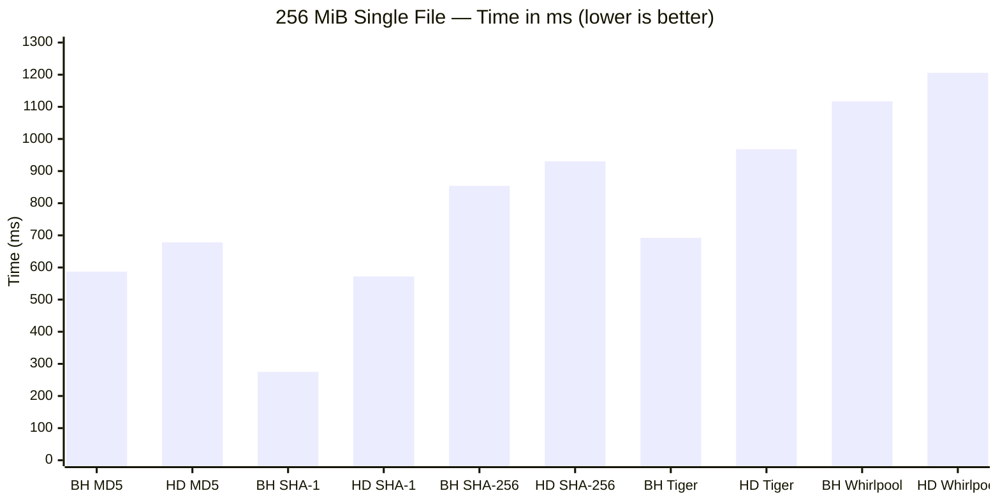
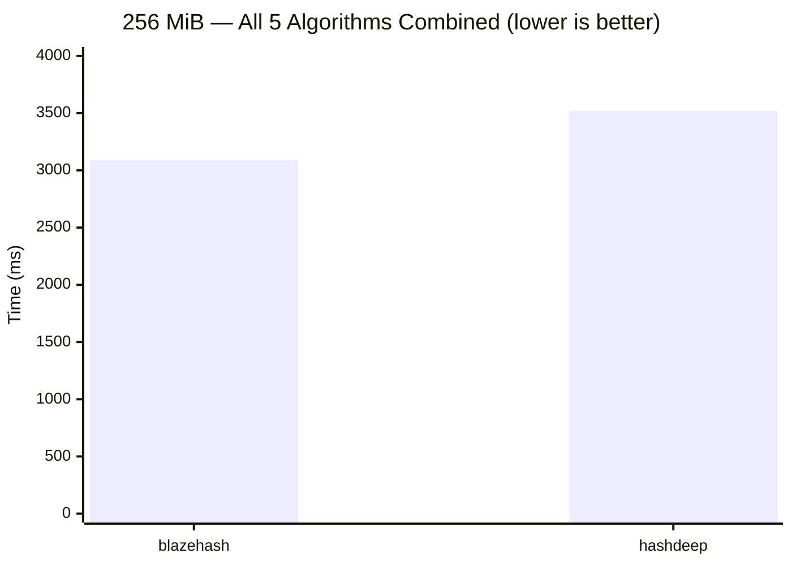
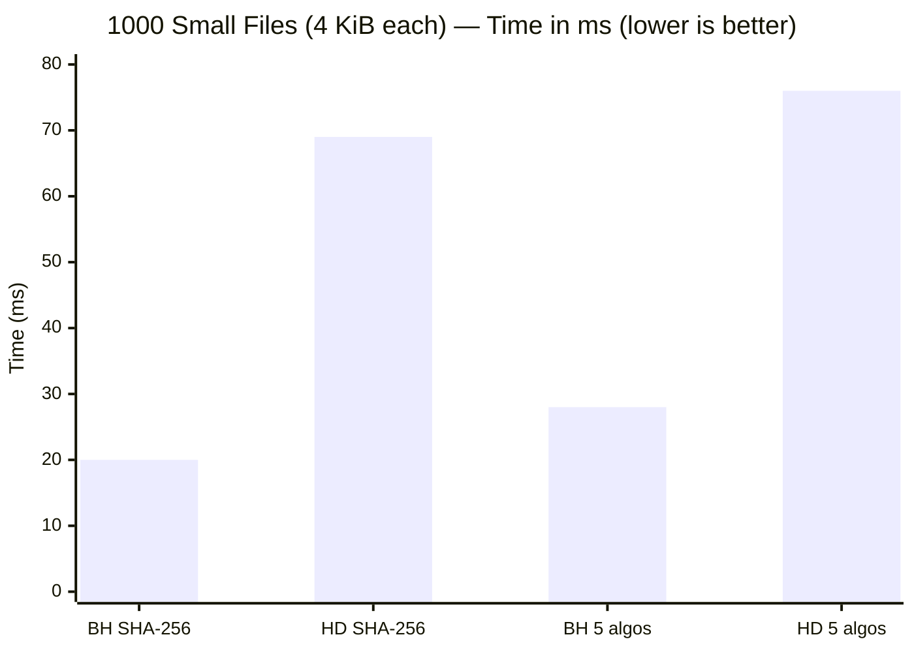
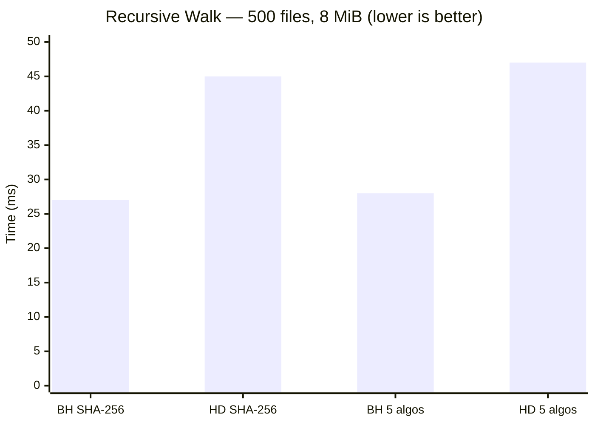
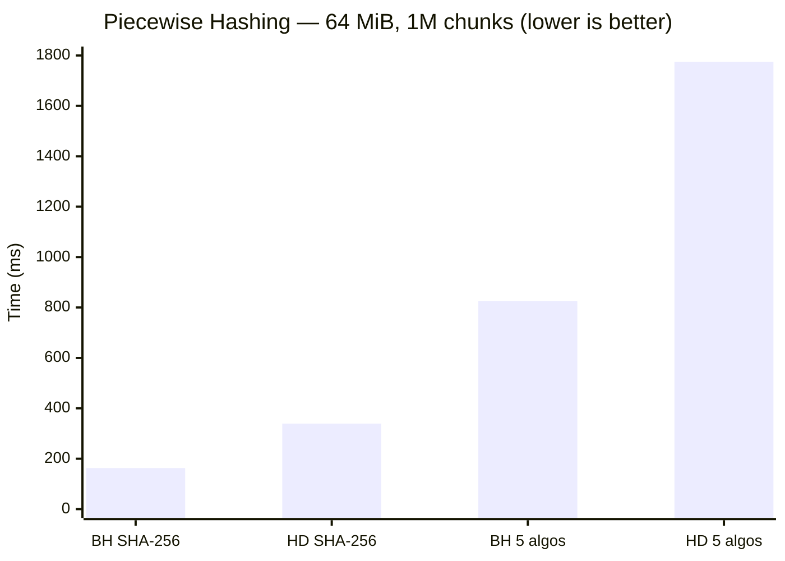
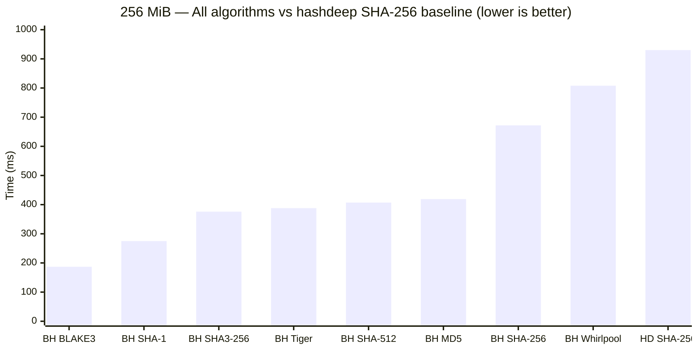

# Benchmarks: blazehash vs hashdeep

blazehash is a drop-in superset of [hashdeep](https://github.com/jessek/hashdeep) v4.4. Every hash it produces is **bit-identical** to hashdeep's output for the same algorithm. The difference is speed.

This page documents measured performance across real forensic workloads, with full methodology.

## Test Environment

| | |
|---|---|
| **CPU** | Apple M4 Pro (14-core) |
| **RAM** | 48 GB LPDDR5X |
| **OS** | macOS 15.7.5 (arm64) |
| **Disk** | Internal NVMe SSD |
| **blazehash** | v0.1.0 (release build, `--release`) |
| **hashdeep** | v4.4 (`brew install md5deep`) |
| **Rust** | stable toolchain |

All benchmarks are run with warm filesystem cache (a warmup pass of both tools precedes every timed measurement). Timing includes full process startup.

> **Reproduce these results yourself:**
> ```bash
> brew install md5deep          # install hashdeep
> cargo test --release --test benchmark_tests -- --ignored --nocapture --test-threads=1
> ```

## Summary

blazehash is **1.1x to 3.4x faster** than hashdeep across all tested workloads, using the same algorithms on the same data. The advantage comes from memory-mapped I/O, multithreaded file walking (rayon), and modern Rust crypto implementations with hardware acceleration (NEON on ARM, SHA-NI / AVX2 on x86).

When you switch from SHA-256 to BLAKE3 (blazehash's default), throughput improves by another **3.6x** on top of that.

## Large File Throughput (256 MiB)

Single-file hashing measures raw algorithm throughput, where process startup overhead is negligible.

> **BH** = blazehash, **HD** = hashdeep v4.4





| Algorithm | blazehash | hashdeep | Speedup |
|-----------|----------:|----------:|--------:|
| MD5 | 587 ms | 678 ms | **1.16x** |
| SHA-1 | 275 ms | 572 ms | **2.08x** |
| SHA-256 | 854 ms | 930 ms | **1.09x** |
| Tiger | 692 ms | 968 ms | **1.40x** |
| Whirlpool | 1117 ms | 1206 ms | **1.08x** |
| **All 5 combined** | **3092 ms** | **3521 ms** | **1.14x** |

SHA-1 shows the largest single-algorithm gain (2.08x) because the Rust `sha1` crate uses ARM SHA-1 hardware extensions (`sha1c`, `sha1p`, `sha1m`, `sha1h`) that hashdeep's C implementation does not.

### Throughput (MB/s)

| Algorithm | blazehash | hashdeep |
|-----------|----------:|----------:|
| MD5 | 436 MB/s | 378 MB/s |
| SHA-1 | 932 MB/s | 448 MB/s |
| SHA-256 | 300 MB/s | 275 MB/s |
| Tiger | 370 MB/s | 264 MB/s |
| Whirlpool | 229 MB/s | 212 MB/s |

## Many Small Files (1000 x 4 KiB)

Small-file workloads measure per-file overhead: directory traversal, file open/close, and thread scheduling. This is the typical forensic workload — thousands of documents, images, and logs.



| Scenario | blazehash | hashdeep | Speedup |
|----------|----------:|----------:|--------:|
| SHA-256 only | 20 ms | 69 ms | **3.43x** |
| All 5 algorithms | 28 ms | 76 ms | **2.75x** |

blazehash's rayon thread pool hashes multiple files in parallel, while hashdeep processes them sequentially. On a 14-core M4 Pro, this translates to a **3.4x** speedup on small-file workloads.

## Recursive Directory Walk (500 files, 3 levels)

Simulates a forensic image with nested directory structure: 5 directories x 5 subdirectories x 20 files (16 KiB each, 8 MiB total).



| Scenario | blazehash | hashdeep | Speedup |
|----------|----------:|----------:|--------:|
| SHA-256 only | 27 ms | 45 ms | **1.68x** |
| All 5 algorithms | 28 ms | 47 ms | **1.69x** |

Note that blazehash's time barely increases when adding more algorithms — parallel hashing across algorithms amortizes the cost.

## Piecewise Hashing (64 MiB, 1M chunks)

Piecewise hashing (`-p`) splits each file into fixed-size chunks and hashes each independently. Used for verifying partial transfers and detecting targeted modifications within large files.



| Scenario | blazehash | hashdeep | Speedup |
|----------|----------:|----------:|--------:|
| SHA-256 (1M chunks) | 163 ms | 339 ms | **2.08x** |
| All 5 algos (1M chunks) | 825 ms | 1775 ms | **2.15x** |

## The BLAKE3 Advantage

hashdeep does not support BLAKE3. blazehash does — and it's the default for good reason.

BLAKE3 was designed from the ground up for modern hardware: internal tree parallelism, SIMD acceleration (NEON on ARM, AVX-512/AVX2/SSE4.1 on x86), and a 1 KiB internal chunk size that maps naturally to CPU cache lines.

The chart below compares all blazehash algorithms against hashdeep's SHA-256 (the most common forensic algorithm and hashdeep's best-performing secure hash) as a reference baseline:

> **BH** = blazehash, **HD** = hashdeep v4.4



| Algorithm | Time (256 MiB) | Throughput | vs hashdeep SHA-256 |
|-----------|---------------:|-----------:|--------------------:|
| **blazehash BLAKE3** | **187 ms** | **1369 MB/s** | **4.97x faster** |
| blazehash SHA-1 | 275 ms | 931 MB/s | 3.38x faster |
| blazehash SHA3-256 | 376 ms | 681 MB/s | 2.47x faster |
| blazehash Tiger | 388 ms | 660 MB/s | 2.40x faster |
| blazehash SHA-512 | 407 ms | 629 MB/s | 2.29x faster |
| blazehash MD5 | 419 ms | 611 MB/s | 2.22x faster |
| blazehash SHA-256 | 672 ms | 381 MB/s | 1.38x faster |
| blazehash Whirlpool | 808 ms | 317 MB/s | 1.15x faster |
| hashdeep SHA-256 | 930 ms | 275 MB/s | *baseline* |

BLAKE3 at **1.37 GB/s** is fast enough to saturate many NVMe drives. For forensic practitioners: switching from `hashdeep -c sha256` to `blazehash` (BLAKE3 default) delivers nearly **5x** end-to-end speedup — the combined benefit of a faster algorithm *and* a faster implementation.

Even using the *same* algorithm (SHA-256), blazehash is **1.38x faster** than hashdeep due to memory-mapped I/O and hardware-accelerated crypto.

## Correctness

Performance means nothing without correctness. blazehash produces **bit-identical** hashes to hashdeep for every shared algorithm.

The benchmark test suite verifies this with 25 cross-tool comparisons:

| Verification | Status |
|-------------|--------|
| MD5 hash match (5 file sizes: 0B, 1B, 1KB, 100KB, 1MB) | Pass |
| SHA-1 hash match (5 file sizes) | Pass |
| SHA-256 hash match (5 file sizes) | Pass |
| Tiger hash match (5 file sizes) | Pass |
| Whirlpool hash match (5 file sizes) | Pass |
| All 5 algos simultaneously | Pass |
| Manifest format (`HASHDEEP-1.0` header, column line) | Pass |
| Cross-tool audit (blazehash audits hashdeep manifest) | Pass |
| Piecewise chunk hashes (per-chunk comparison) | Pass |

## Methodology

- **Warm cache:** Every benchmark includes a warmup pass (both tools run once, results discarded) before the timed run. This eliminates filesystem cache bias.
- **Process-inclusive timing:** Measurements include process startup (`fork` + `exec`), not just hash computation. This is representative of real CLI usage.
- **Deterministic data:** Test files use a seeded pseudo-random generator (LCG) for reproducibility across runs and machines.
- **Single-threaded execution:** Benchmarks run with `--test-threads=1` to prevent interference between tests.
- **Release builds:** blazehash is compiled with `--release` (full optimizations, LTO).

### Source

All benchmarks are implemented as Rust integration tests in [`tests/benchmark_tests.rs`](../tests/benchmark_tests.rs). Run them yourself:

```bash
# Install hashdeep (required for comparison tests)
brew install md5deep          # macOS
sudo apt install hashdeep     # Debian/Ubuntu

# Run all benchmarks
cargo test --release --test benchmark_tests -- --ignored --nocapture --test-threads=1

# Run just correctness checks
cargo test --release --test benchmark_tests -- --ignored --nocapture compat_

# Run just performance benchmarks
cargo test --release --test benchmark_tests -- --ignored --nocapture bench_
```
