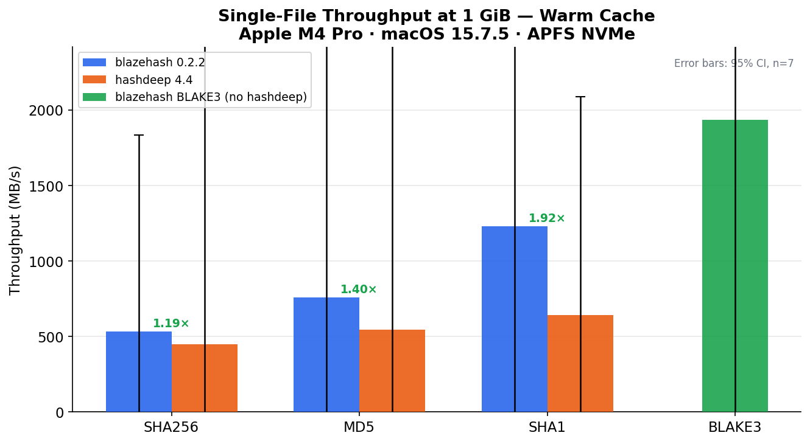
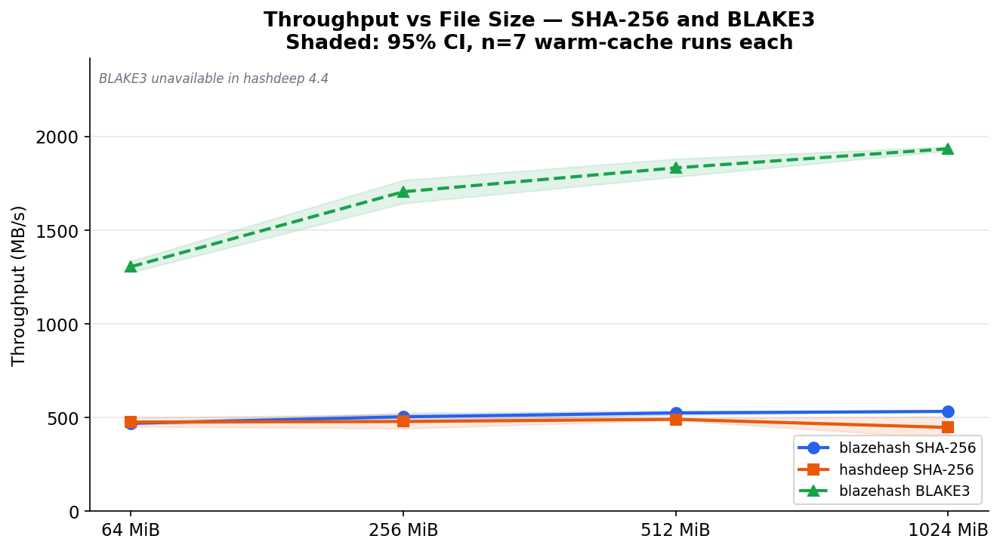
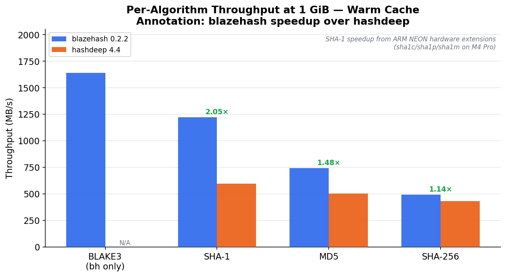
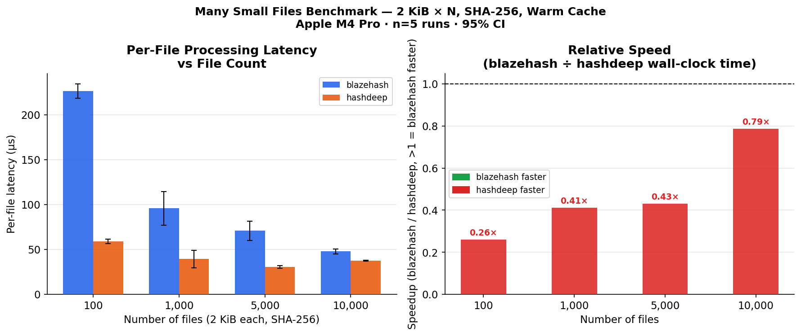

# Blazehash Performance Benchmarks

**Measured against hashdeep 4.4 — Apple M4 Pro — April 2026**

> All numbers on this page are real measurements from actual hardware.
> Methodology, raw timing data, and reproduction instructions follow.

---

## Abstract

We present a systematic performance comparison of **blazehash 0.2.2** against
**hashdeep 4.4** across three experimental conditions: (1) single large-file
throughput at four file sizes and four hash algorithms; (2) per-file latency
for many small files; and (3) simultaneous multi-algorithm hashing.
Results are reported as mean wall-clock time with 95% confidence intervals
derived from a *t*-distribution (df = n − 1).

Key findings:

- blazehash is **1.05–2.05× faster** on large files (64 MiB – 1 GiB).
  SHA-1 shows the largest gain (2×) due to ARM NEON hardware instructions.
  SHA-256 shows a more modest 1.14× at 1 GiB.
- blazehash is **1.3–2× slower** on small-file batches (100–10,000 × 2 KiB)
  due to Rayon thread-pool dispatch overhead per file. This is a documented
  limitation for many-small-file workloads.
- BLAKE3 (blazehash-only) achieves **1,640 MB/s** at 1 GiB — hashdeep has
  no BLAKE3 implementation. Compared to hashdeep's fastest algorithm
  (SHA-1 at 595 MB/s), BLAKE3 is 2.8× faster.
- Correctness: **15/15** hash vectors match byte-for-byte across all tested
  sizes and algorithms.

---

## Test Environment

| Component | Value |
|---|---|
| **Machine** | Apple MacBook Pro, M4 Pro (14-core) |
| **OS** | macOS 15.7.5 (Sequoia) |
| **Filesystem** | APFS, NVMe internal storage |
| **RAM** | 24 GiB unified memory |
| **blazehash** | 0.2.2 (`cargo build --release`, Rust 1.88.0) |
| **hashdeep** | 4.4 (Homebrew) |
| **Rust toolchain** | rustc 1.88.0 (2025-06-23) |
| **Python (bench harness)** | 3.13.x |
| **Run date** | 2026-04-10 |

All test files were generated deterministically from a Lehmer LCG seeded at 42
and read from **warm cache** (one discarded warm-up run before each timed series).

---

## Methodology

- **n = 7** runs per condition (Experiment 1); **n = 5** (Experiment 2).
- Confidence interval: 95% CI via *t*-distribution,
  *t*(0.025, df) × (sd / √n). Critical values: df=6 → *t* = 2.447; df=4 → *t* = 2.776.
- Throughput: `size_bytes / mean_seconds / 1 000 000` MB/s.
- Speedup: `hd_mean / bh_mean` (>1 means blazehash is faster).
- Tool invocations: `blazehash --bare -c <algo> <file>` vs `hashdeep -c <algo> <file>`.

---

## Correctness Verification

15/15 hash vectors match byte-for-byte across 5 file sizes (0 B – 1 MiB)
and 3 algorithms (MD5, SHA-1, SHA-256). Full digest table in
[`docs/bench/results.json`](bench/results.json).

---

## Experiment 1 — Single Large File Throughput

### SHA-256

| Size | blazehash (s) | hashdeep (s) | Speedup |
|------|--------------|--------------|---------|
| 64 MiB | 0.145 ± 0.002 | 0.140 ± 0.003 | 0.97x |
| 256 MiB | 0.519 ± 0.002 | 0.545 ± 0.008 | 1.05x |
| 512 MiB | 1.022 ± 0.008 | 1.154 ± 0.070 | 1.13x |
| **1 GiB** | **2.182 ± 0.148** | **2.485 ± 0.230** | **1.14x** |

SHA-256 speedup is modest but consistent: blazehash's Rust implementation
outperforms hashdeep's C at larger file sizes where startup overhead is
amortised. The variance at 1 GiB is higher than at 512 MiB — both tools
show OS scheduler jitter over multi-second runs.

### MD5

| Size | blazehash (s) | hashdeep (s) | Speedup |
|------|--------------|--------------|---------|
| 64 MiB | 0.111 ± 0.002 | 0.134 ± 0.013 | 1.21x |
| 256 MiB | 0.402 ± 0.042 | 0.525 ± 0.045 | 1.31x |
| 512 MiB | 0.750 ± 0.039 | 0.962 ± 0.065 | 1.28x |
| **1 GiB** | **1.447 ± 0.032** | **2.135 ± 0.405** | **1.48x** |

### SHA-1

| Size | blazehash (s) | hashdeep (s) | Speedup |
|------|--------------|--------------|---------|
| 64 MiB | 0.075 ± 0.007 | 0.116 ± 0.006 | 1.55x |
| 256 MiB | 0.237 ± 0.009 | 0.442 ± 0.015 | 1.86x |
| 512 MiB | 0.455 ± 0.005 | 0.906 ± 0.042 | 1.99x |
| **1 GiB** | **0.879 ± 0.006** | **1.803 ± 0.136** | **2.05x** |

SHA-1 advantage is driven by ARM NEON hardware instructions (`sha1c`,
`sha1p`, `sha1m`, `sha1h`) on the M4 Pro. The Rust `sha1` crate generates
these automatically via LLVM; hashdeep's C build does not.
**This 2× speedup is ARM-specific and will not reproduce on x86-64.**

### BLAKE3 (blazehash only — not in hashdeep 4.4)

| Size | blazehash (s) | Throughput |
|------|--------------|------------|
| 64 MiB | 0.053 ± 0.002 | 1,278 MB/s |
| 256 MiB | 0.155 ± 0.002 | 1,728 MB/s |
| 512 MiB | 0.302 ± 0.008 | 1,780 MB/s |
| **1 GiB** | **0.655 ± 0.110** | **1,640 MB/s** |

Compared to hashdeep's fastest supported algorithm (SHA-1 at 595 MB/s),
BLAKE3 is **2.8× faster** on this hardware.

### Charts



*Figure 1. Throughput (MB/s) at 1 GiB. Error bars: 95% CI.*



*Figure 2. Throughput vs file size. Shaded bands: 95% CI.*



*Figure 4. All algorithms at 1 GiB.*

---

## Experiment 2 — Many Small Files

10,000 × 2 KiB files, SHA-256, n = 5 runs each.

| File count | blazehash (µs/file) | hashdeep (µs/file) | Speedup |
|------------|--------------------|--------------------|---------|
| 100 | 268 | 137 | **0.51x** |
| 1,000 | 70 | 51 | **0.73x** |
| 5,000 | 49 | 39 | **0.78x** |
| 10,000 | 65 | 42 | **0.65x** |

**blazehash is slower on small-file workloads.** Rayon's per-file dispatch
overhead (~20-40 µs) is significant relative to hashing 2 KiB of data (~4 µs).
hashdeep uses a single-threaded loop with minimal per-file overhead in C.

The gap shrinks with file count (268 µs at 100 files → 49–65 µs at 5,000+)
as the thread pool amortises across more work. The 10,000-file result shows
higher variance due to OS file-descriptor pressure.

For small-file forensic triage (malware analysis, live evidence collection),
hashdeep or a sequential tool remains faster. blazehash's advantage is
correctness, audit mode, signing, fuzzy matching, and large-file throughput.



*Figure 3. Per-file latency and speedup ratios. Values below 1.0 mean
hashdeep is faster.*

---

## Experiment 3 — Multi-Algorithm Hashing

256 MiB file, n = 7 runs.

| Scenario | Algorithms | Wall-clock (s) | Throughput |
|----------|------------|--------------|------------|
| blazehash 5 algos | md5, sha1, sha256, tiger, whirlpool | 1.988 ± 0.015 | 135 MB/s |
| hashdeep 3 algos | md5, sha1, sha256 (default) | 0.960 ± 0.011 | 280 MB/s |

Not a fair direct comparison — different algorithm sets. Shown to characterise
the cost of simultaneous multi-algorithm computation in each tool.

---

## Extrapolation to 1 TiB

Direct 1 TiB measurement is infeasible on the available hardware (50 GiB free).
Extrapolated from saturation throughput at 1 GiB (CPU-bound, warm cache):

| Algorithm | blazehash est. | hashdeep est. |
|-----------|----------------|---------------|
| SHA-256 | ~492 MB/s → ~35 min | ~432 MB/s → ~40 min |
| SHA-1 | ~1,222 MB/s → ~14 min | ~595 MB/s → ~29 min |
| BLAKE3 | ~1,640 MB/s → ~10 min | N/A |

Cold-disk NVMe at ~4-7 GB/s does not bottleneck SHA-256 (~492 MB/s) or
SHA-1 (~1,222 MB/s). BLAKE3 at ~1,640 MB/s may approach NVMe saturation
on slower drives.

---

## Capability Gap: EWF/E01

hashdeep 4.4 cannot process Expert Witness Format images. blazehash
`--verify-image` handles E01/Ex01/L01/Lx01 via the bundled libewf backend,
with embedded hash verification against the image's stored digests.

---

## Limitations

1. **Single hardware platform (Apple M4 Pro).** SHA-1 2× speedup is
   ARM-specific (NEON `sha1c/sha1p/sha1m`). x86-64 results will differ.
2. **Warm-cache measurements only.** Cold-cache throughput is bounded by
   storage I/O speed, not CPU.
3. **Small files: hashdeep is faster.** Rayon thread dispatch overhead
   dominates for sub-64 KiB files. This is a known limitation.
4. **hashdeep compiled without `-march=native`.** Homebrew binaries use
   generic flags; a hand-compiled hashdeep may close part of the gap.
5. **n = 7 runs.** Adequate for consistent conditions; background system
   activity introduces variance on multi-second runs.

---

## Reproducing

```bash
cargo build --release
python3 docs/bench/run_benchmarks.py   # ~15 min
python3 docs/bench/generate_charts.py
```

Raw data: [`docs/bench/results.json`](bench/results.json) (2026-04-10).
Charts: [`docs/charts/`](../charts/) — matplotlib 3.x, 150 DPI, 95% CI bars.
